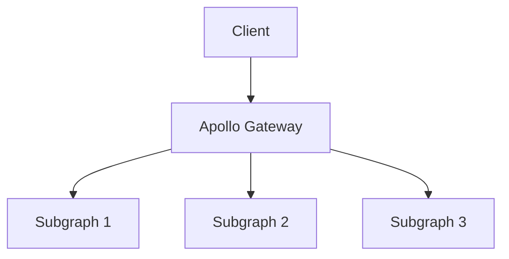
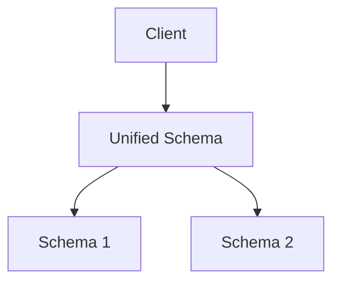

# Apollo Federation and Schema Stitching

Apollo Federation and Schema Stitching are two powerful strategies that help break down monolithic GraphQL architectures into more modular and scalable services. While both approaches achieve the goal of combining multiple GraphQL services into a single API, they do so in different ways and are suitable for different scenarios.

## 1. Apollo Federation Overview

Apollo Federation is a modern approach to GraphQL microservices. It allows you to create a single, unified data graph from multiple services (also known as subgraphs). Each service manages its own part of the graph, and Apollo Federation stitches these together at runtime.

### Key Components of Apollo Federation:

1. **Subgraphs**: Individual GraphQL services that manage specific parts of the schema.
2. **Apollo Gateway**: The central service that composes subgraph schemas into a single unified schema and routes incoming GraphQL queries to the appropriate subgraph.
3. **@key and @extends Directives**: Federation uses these special schema directives to combine and share entities across different services.

### How Apollo Federation Works:

Apollo Federation lets you split your API into multiple services, with each subgraph responsible for a specific domain (e.g., users, products, orders). The Apollo Gateway is responsible for merging the individual schemas into a single federated schema.



### Example:

#### Subgraph 1: Product Service

```graphql
# product-service/schema.graphql
type Product @key(fields: "id") {
  id: ID!
  name: String
  price: Float
}

type Query {
  products: [Product]
}
```

#### Subgraph 2: Review Service

```graphql
# review-service/schema.graphql
type Review @key(fields: "id") {
  id: ID!
  content: String
  product: Product @provides(fields: "id")
}

extend type Product @key(fields: "id") {
  id: ID! @external
  reviews: [Review]
}

type Query {
  reviews: [Review]
}
```

In this example:
- The `Product` entity is defined in the `product-service` and extended in the `review-service`.
- The `review-service` extends the `Product` type to associate reviews with products.
- The `@key`, `@provides`, and `@external` directives help to link the data between the two services.

### Setting Up Apollo Gateway:

The Apollo Gateway service acts as the entry point for client requests. It routes queries to the appropriate subgraph based on the federated schema.

#### Example Gateway Configuration:

```javascript
const { ApolloGateway } = require('@apollo/gateway');
const { ApolloServer } = require('apollo-server');

const gateway = new ApolloGateway({
  serviceList: [
    { name: 'product', url: 'http://localhost:4001/graphql' },
    { name: 'review', url: 'http://localhost:4002/graphql' }
  ],
});

const server = new ApolloServer({ gateway, subscriptions: false });

server.listen().then(({ url }) => {
  console.log(`🚀 Gateway ready at ${url}`);
});
```

### Benefits of Apollo Federation:

- **Modularization**: Split your schema across multiple services to keep services focused and maintainable.
- **Independent Deployments**: Each subgraph can be deployed independently, enabling faster development cycles.
- **Entity Sharing**: Easily share and extend entities across services using Apollo Federation’s directives.

---

## 2. Schema Stitching Overview

Schema Stitching is an earlier approach to combining multiple GraphQL services into a single API. In schema stitching, individual GraphQL schemas are manually merged together into a single schema. While it shares the goal of unifying schemas, schema stitching doesn’t offer the same advanced features and scalability as Apollo Federation.

### How Schema Stitching Works:

With schema stitching, multiple GraphQL services are combined by stitching their schemas together. The combined schema is then exposed as a single API.



### Example:

Let’s say you have two independent services, a `user-service` and a `post-service`. With schema stitching, you can combine them into a single API.

#### User Service Schema:

```graphql
type User {
  id: ID!
  name: String
}

type Query {
  user(id: ID!): User
}
```

#### Post Service Schema:

```graphql
type Post {
  id: ID!
  title: String
  author: User
}

type Query {
  post(id: ID!): Post
}
```

#### Stitching These Schemas:

To combine these schemas, we can use the `makeExecutableSchema` function from `@graphql-tools/schema` to stitch them together.

```javascript
const { makeExecutableSchema, mergeSchemas } = require('@graphql-tools/schema');
const { ApolloServer } = require('apollo-server');

// Define schemas and resolvers for user and post services
const userSchema = makeExecutableSchema({ typeDefs: userTypeDefs, resolvers: userResolvers });
const postSchema = makeExecutableSchema({ typeDefs: postTypeDefs, resolvers: postResolvers });

// Merge the schemas into one
const mergedSchema = mergeSchemas({
  schemas: [userSchema, postSchema],
  resolvers: {
    Post: {
      author: {
        fragment: '... on Post { authorId }',
        resolve(post, args, context, info) {
          return info.mergeInfo.delegateToSchema({
            schema: userSchema,
            operation: 'query',
            fieldName: 'user',
            args: { id: post.authorId },
            context,
            info,
          });
        },
      },
    },
  },
});

// Start the server with the merged schema
const server = new ApolloServer({ schema: mergedSchema });

server.listen().then(({ url }) => {
  console.log(`🚀 Server ready at ${url}`);
});
```

### Benefits of Schema Stitching:

- **Simple Integration**: Easily combine existing GraphQL schemas.
- **Custom Resolvers**: You can manually resolve fields between services using custom logic.
- **Familiar Approach**: Schema stitching may feel more familiar to teams already using traditional monolithic GraphQL schemas.

### Limitations of Schema Stitching:

- **Tight Coupling**: Unlike Apollo Federation, schema stitching leads to tightly coupled services.
- **Scaling Challenges**: Schema stitching can become challenging to scale and manage in complex applications.
- **No Built-In Entity Sharing**: It doesn’t support the entity-sharing mechanisms offered by Apollo Federation.

---

## 3. Comparing Apollo Federation and Schema Stitching

| Feature                     | Apollo Federation                       | Schema Stitching                    |
|------------------------------|-----------------------------------------|-------------------------------------|
| **Modularity**               | High - Subgraphs can be deployed independently | Low - Tightly coupled services      |
| **Entity Sharing**            | Yes - @key, @external, @extends         | No - Requires manual resolution     |
| **Scalability**              | High - Designed for large-scale apps    | Low - Difficult to manage at scale  |
| **Deployment**               | Independent service deployment          | Single combined service             |
| **Use Case**                 | Microservices, distributed systems      | Combining small APIs, monolithic apps|

---

## 4. When to Use Apollo Federation vs. Schema Stitching

- **Use Apollo Federation** if you have multiple teams or services that need to manage their own parts of the schema. Federation excels in microservices architectures where you need modular, scalable, and independently deployable services.
  
- **Use Schema Stitching** if you’re working with smaller projects or legacy systems that need to combine existing GraphQL APIs. It’s useful when you don’t need the advanced features of Apollo Federation but still want to expose a unified API.

## Conclusion

Both Apollo Federation and Schema Stitching provide ways to combine multiple GraphQL services into a single API. Apollo Federation offers a more scalable, modular, and modern approach, making it the ideal choice for larger systems with distributed teams. Schema Stitching, on the other hand, may be a simpler solution for smaller projects or legacy systems.
